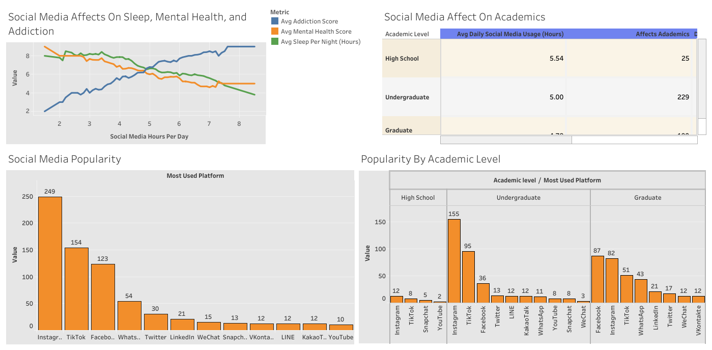

# Mom Was Right, It’s That Damn Phone! 📱  

*An analysis of how social media use impacts student sleep, mental health, addiction, and academics.*  

  
  

---

## 📖 Project Overview  
This project analyzes students' social media usage and its effects on sleep, mental health, addiction, and academic performance.  

The data comes from a Kaggle dataset containing anonymized records of students’ social media behaviors and related life outcomes:  
[Social Media Addiction vs Relationships Dataset](https://www.kaggle.com/datasets/adilshamim8/social-media-addiction-vs-relationships)  

---

## 📊 Tableau Visualization  
Below is a snapshot of the interactive Tableau dashboard created for this project:  

  

🔗 [**View the full interactive dashboard on Tableau Public →**](https://public.tableau.com/app/profile/carlos.austin/viz/SocialMediaUseAmongstStudents/Dashboard1?publish=yes)  
---
## 📂 Repository Contents  

- **README.md** → Project overview, documentation, and links to the interactive Tableau dashboard.
- **SQL Code** → SQL queries for data cleaning, exploration, and analysis.  
- **social_media_dashboard.png** → Screenshot of Tableau dashboard.

---

## 🛠 Skills Demonstrated  

- **SQL Aggregations** → Used `AVG()`, `COUNT()`, and `ROUND()` to calculate averages, totals, and percentages.  
- **Grouping & Ordering** → Applied `GROUP BY` and `ORDER BY` to analyze patterns across usage levels, platforms, and academic levels.  
- **Conditional Logic** → Leveraged `CASE WHEN` to segment responses (e.g., whether social media affects academics).  
- **Percentage Calculations** → Computed relative proportions of platform usage and academic impacts.  
- **Data Storytelling** → Translated SQL outputs into clear insights and built interactive dashboards in Tableau.

 ---

 ## 🔑 Key Insights  

- Students with **higher daily social media usage** reported fewer sleep hours, lower mental health scores, and higher addiction scores.  
- **Younger students** experienced greater academic impacts compared to more advanced students, even at similar usage levels.  
- **Platform preferences varied by academic level**:  
  - **Instagram** was consistently popular across high school, undergrad, and graduate students.  
  - **TikTok** use was strongest among high schoolers and undergrads.  
  - **Facebook** was most popular among graduate students.
